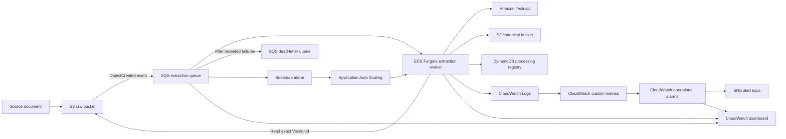
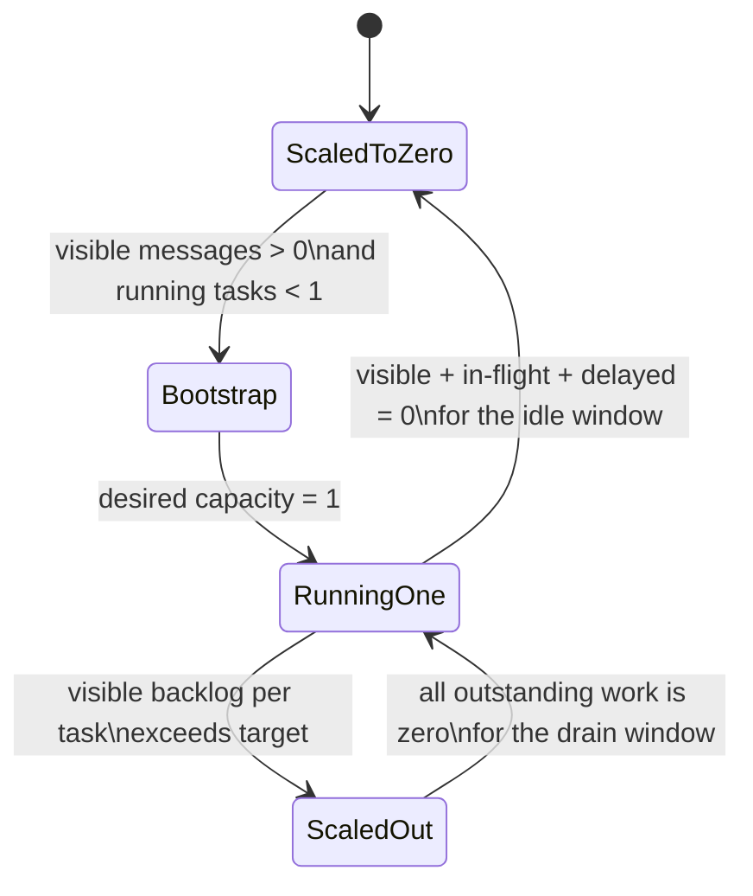

# Extraction Service Infrastructure

Terraform infrastructure for the Clinical Knowledge Base extraction service.

This directory owns the complete AWS infrastructure required to receive versioned clinical documents, process them with an ECS Fargate worker, persist canonical extraction outputs, prevent concurrent duplicate processing, scale worker capacity from zero, and provide operational monitoring and alerts.

## Table of Contents

- [Overview](#overview)
- [Architecture](#architecture)
- [Directory Structure](#directory-structure)
- [Component Responsibilities](#component-responsibilities)
- [Document Processing Flow](#document-processing-flow)
- [Autoscaling Design](#autoscaling-design)
- [Reliability and Idempotency](#reliability-and-idempotency)
- [Security](#security)
- [Observability](#observability)
- [Configuration](#configuration)
- [Terraform State](#terraform-state)
- [Prerequisites](#prerequisites)
- [Common Workflows](#common-workflows)
- [Validation and Testing](#validation-and-testing)
- [Operational Verification](#operational-verification)
- [Troubleshooting](#troubleshooting)
- [Cost Considerations](#cost-considerations)
- [Resource Address Migration](#resource-address-migration)
- [Change Guidelines](#change-guidelines)

## Overview

The extraction service uses an event-driven worker architecture:

1. A source document is uploaded to the raw S3 bucket under `documents/`.
2. Amazon S3 publishes an object-created event to the extraction SQS queue.
3. Application Auto Scaling starts an ECS worker when the service is at zero capacity.
4. The worker downloads the exact S3 object version referenced by the event.
5. The worker extracts text, images, and tables, using Amazon Textract when OCR is required.
6. Canonical output is written to the canonical S3 bucket.
7. A success manifest records completed canonical persistence.
8. A DynamoDB processing registry coordinates exclusive processing ownership and records completion.
9. The SQS message is acknowledged only after successful processing.
10. Worker capacity returns to zero after the queue remains fully idle for the configured period.

The infrastructure is organized as one Terraform root module with four internal components. Each component is an organizational child module owned exclusively by the extraction service.

## Architecture



### AWS resources

The infrastructure manages the following major resources:

- Two encrypted, versioned S3 buckets:
  - Raw document bucket
  - Canonical document bucket
- S3 object-created notification for the `documents/` prefix
- Extraction SQS queue
- Extraction dead-letter queue
- S3-to-SQS queue policy
- DynamoDB processing registry with TTL and point-in-time recovery
- ECR repository with image scanning and lifecycle cleanup
- ECS Fargate cluster, task definition, and service
- ECS task role and execution role
- Application Auto Scaling target and policies
- CloudWatch log group
- CloudWatch log metric filters
- CloudWatch scaling and operational alarms
- CloudWatch dashboard
- SNS alert topic and email subscription
- VPC, public subnets, internet gateway, route table, and ECS security group

## Directory Structure

```text
infra/
├── README.md
├── main.tf
├── providers.tf
├── variables.tf
├── outputs.tf
├── moved.tf
│
├── config/
│   ├── backend_config.tfvars
│   └── variables.tfvars
│
└── components/
    ├── foundation/
    │   ├── locals.tf
    │   ├── variables.tf
    │   ├── outputs.tf
    │   ├── network.tf
    │   ├── security.tf
    │   ├── storage.tf
    │   ├── messaging.tf
    │   ├── registry.tf
    │   ├── alerts.tf
    │   └── templates/
    │       └── s3-sqs-policy.json.tpl
    │
    ├── worker/
    │   ├── locals.tf
    │   ├── variables.tf
    │   ├── outputs.tf
    │   ├── ecr.tf
    │   ├── iam.tf
    │   ├── logs.tf
    │   ├── ecs.tf
    │   └── templates/
    │       ├── ecs-task-definition.json.tpl
    │       ├── extraction-permissions-policy.json.tpl
    │       └── extraction-trust-policy.json.tpl
    │
    ├── autoscaling/
    │   ├── locals.tf
    │   ├── variables.tf
    │   ├── outputs.tf
    │   ├── target.tf
    │   ├── backlog.tf
    │   ├── bootstrap.tf
    │   ├── drain.tf
    │   └── idle.tf
    │
    └── observability/
        ├── locals.tf
        ├── variables.tf
        ├── outputs.tf
        ├── metrics.tf
        ├── alarms.tf
        └── dashboard.tf
```

### Root module files

- `main.tf`: Composes the four extraction infrastructure components.
- `providers.tf`: Declares the Terraform version, S3 backend, AWS provider, and provider constraints.
- `variables.tf`: Defines the public configuration contract and validation rules.
- `outputs.tf`: Preserves the public outputs used by deployment scripts and AWS tests.
- `moved.tf`: Records the historical migration from root resource addresses to component addresses.
- `config/backend_config.tfvars`: Configures the remote S3 state backend.
- `config/variables.tfvars`: Supplies development environment values.

## Component Responsibilities

### Foundation

`components/foundation/` owns persistent service infrastructure and event delivery.

Resources include:

- VPC
- Two public subnets
- Internet gateway
- Public route table and associations
- ECS security group
- Raw S3 bucket
- Canonical S3 bucket
- S3 versioning, encryption, public-access blocking, and lifecycle rules
- S3 object-created notification
- Extraction queue
- Dead-letter queue
- S3-to-SQS queue policy
- DynamoDB processing registry
- SNS alert topic and email subscription

The foundation component exposes bucket names, queue identifiers, registry identifiers, network identifiers, and the SNS alert topic ARN to the other components.

### Worker

`components/worker/` owns the executable extraction runtime.

Resources include:

- ECR repository
- ECR lifecycle policy
- ECS task role
- ECS execution role
- Extraction IAM permissions policy
- Role-policy attachments
- CloudWatch log group
- ECS cluster
- ECS task definition
- ECS service

The worker runs on AWS Fargate using `awsvpc` networking. It receives the extraction queue URL, canonical bucket name, processing registry name, heartbeat settings, and schema version as environment variables.

The service ignores changes to `desired_count` because Application Auto Scaling owns runtime capacity.

### Autoscaling

`components/autoscaling/` owns the complete worker-capacity lifecycle.

Files map directly to scaling behavior:

- `target.tf`: ECS scalable target
- `backlog.tf`: Backlog-per-running-task target tracking
- `bootstrap.tf`: Scale from zero to one
- `drain.tf`: Reduce excess workers directly to one
- `idle.tf`: Scale the final worker from one to zero

Scaling alarms are located beside the policies they trigger. This keeps each scaling transition self-contained and easier to review.

### Observability

`components/observability/` owns application metrics, operational alarms, and the CloudWatch dashboard.

Resources include:

- Processing-success metric filter
- Processing-failure metric filter
- Processing-duration metric filter
- Processing-failure alarm
- Dead-letter queue alarm
- Oldest-message-age alarm
- Extraction operations dashboard

Scaling alarms remain in the autoscaling component because they are part of capacity control rather than operator alerting.

## Document Processing Flow

### Source event contract

The raw bucket sends S3 object-created events for keys under:

```text
documents/
```

The worker requires the event to include the S3 object `versionId`. Version-aware processing ensures that the worker downloads and processes the exact immutable object version that generated the event.

Expected source key shape:

```text
documents/<study-id>/<document-category>/<file>
```

Shared documents use:

```text
documents/shared/<document-category>/<file>
```

### Canonical output layout

Canonical objects remain machine-oriented and are stored under a deterministic document identity:

```text
canonical-documents/<document-id>/
├── extracted-document.json
├── _SUCCESS.json
├── images/
└── tables/
```

The deterministic `document_id` is generated from:

- Source bucket
- Source key
- Source S3 version ID
- Processing schema version

The ingestion service should consume the explicit `canonical_bucket` and `canonical_key` recorded in the manifest, event, or processing registry. It should not infer metadata by parsing the physical S3 key structure.

### Completion semantics

Processing is considered complete only after:

1. Canonical assets are uploaded.
2. `extracted-document.json` is saved.
3. `_SUCCESS.json` is saved.
4. The processing registry is marked `COMPLETED`.
5. The SQS message is deleted.

A success manifest is the authoritative proof that canonical persistence completed.

## Autoscaling Design

The extraction service is designed to run at zero capacity when idle.



### 0 to 1: bootstrap

The `bootstrap_queue_not_empty` alarm evaluates a metric-math expression based on:

- Visible SQS messages
- Running ECS task count

The alarm triggers only when visible messages exist and fewer than one ECS task is running.

The `bootstrap_scale_out` policy uses `ExactCapacity` to set desired capacity to exactly one. This prevents repeated bootstrap increments while the first task is starting.

### 1 to maximum: target tracking

The `backlog_per_task` target-tracking policy scales worker capacity according to:

```text
visible SQS messages / running ECS tasks
```

Development configuration currently targets:

```text
5 visible messages per running task
```

Target tracking handles proportional scale-out and scale-in while visible backlog remains.

### Excess capacity to 1: queue drained

When all visible, in-flight, and delayed messages remain zero for the configured drain window, the `queue_drained_to_one` alarm triggers an `ExactCapacity` policy.

Examples:

```text
5 workers -> 1 worker
4 workers -> 1 worker
3 workers -> 1 worker
2 workers -> 1 worker
```

This prevents gradual target-tracking scale-in from keeping unnecessary workers running after the queue is fully drained.

### 1 to 0: sustained idle

The final worker is scaled to zero only when:

```text
visible messages + in-flight messages + delayed messages = 0
```

for the configured number of consecutive one-minute periods.

The development configuration requires five consecutive idle periods. The `idle_scale_to_zero` policy then sets desired capacity to zero.

### Development scaling values

Current development values include:

```text
Minimum capacity:                       0
Maximum capacity:                       5
Backlog target per worker:              5 messages
Target-tracking scale-out cooldown:     60 seconds
Target-tracking scale-in cooldown:      300 seconds
Queue-drained evaluation periods:       2
Queue-drained cooldown:                 60 seconds
Scale-to-zero evaluation periods:       5
Scale-to-zero cooldown:                 300 seconds
```

The authoritative values are in `config/variables.tfvars`.

## Reliability and Idempotency

### SQS visibility heartbeat

The worker periodically extends SQS message visibility while processing is active. This reduces the risk of another worker receiving the same message during long document processing.

Relevant task settings:

```text
SQS_VISIBILITY_EXTENSION_SECONDS
SQS_VISIBILITY_HEARTBEAT_SECONDS
```

The heartbeat interval must be less than the extension duration.

### DynamoDB processing claim

Before extraction begins, the worker acquires an exclusive processing claim in DynamoDB.

The claim contains:

- Document ID
- Owner token
- Processing status
- Source bucket and key
- Source version ID
- Processing schema version
- Lease expiration
- TTL

A claim heartbeat renews the lease while processing continues.

Relevant task settings:

```text
PROCESSING_CLAIM_LEASE_SECONDS
PROCESSING_CLAIM_HEARTBEAT_SECONDS
```

The claim lease must be longer than the SQS visibility extension, and the claim heartbeat interval must be shorter than the claim lease.

### Duplicate events

Duplicate events for the same source version and processing schema produce the same deterministic `document_id`.

If a valid success manifest already exists, the worker:

1. Validates the manifest identity.
2. Skips extraction.
3. Reconciles the processing registry if needed.
4. Acknowledges the duplicate message successfully.

A new S3 object version produces a new identity and a separate canonical result.

### Failed processing

If document processing fails:

- Canonical completion is not recorded.
- The SQS message is not deleted.
- The processing claim is released when ownership is still valid.
- Uploaded assets from a failed run are cleaned up where possible.
- Repeated failures eventually move the message to the DLQ according to the redrive policy.

## Security

### S3

Both raw and canonical buckets use:

- S3 versioning
- AES-256 server-side encryption
- Public access blocking
- Noncurrent-version expiration
- Incomplete multipart-upload cleanup

### IAM

The ECS task role follows least-privilege service access for:

- Reading source documents and exact object versions
- Reading, writing, listing, and cleaning canonical objects
- Consuming and acknowledging extraction queue messages
- Extending SQS message visibility
- Running Textract text detection
- Managing DynamoDB processing claims
- Opening ECS Exec control and data channels

The ECS execution role uses the AWS-managed task execution policy for image pulls and log delivery.

### Network

The worker uses a dedicated VPC with two public subnets across available zones.

The ECS security group has:

- No inbound rules
- Outbound access enabled

Tasks receive public IP addresses so they can access AWS service endpoints without a NAT gateway. This keeps development infrastructure simpler and less expensive. Production environments may choose private subnets with VPC endpoints or a NAT architecture.

### Secrets and personal configuration

Do not commit credentials, access keys, state files, saved plans, or sensitive application values.

The alert email is currently supplied through the environment variable file. If environment configuration becomes shared more broadly, consider supplying personal alert endpoints through an untracked local variable file or CI/CD variable.

## Observability

### CloudWatch logs

ECS task logs are written to:

```text
/ecs/<project>-extraction-<environment>
```

The development log-retention period is configured through `log_retention_days`.

### Custom metrics

Structured worker logs are converted into these custom metrics:

```text
ProcessingSuccesses
ProcessingFailures
ProcessingDurationSeconds
```

The custom namespace follows:

```text
<project-name>/Extraction/<environment>
```

### Operational alarms

Operational alert alarms include:

- One or more visible messages in the DLQ
- Oldest extraction message exceeding the configured age threshold
- One or more processing-failure logs during the alarm period

Alerts are delivered through the SNS topic and its email subscription.

### Scaling alarms

Scaling alarms include:

- Bootstrap queue-not-empty alarm
- Queue-drained-to-one alarm
- Queue-depth-empty alarm

The queue-depth-empty alarm may be in `ALARM` state while the service is healthily scaled to zero. In this design, the alarm state is also used as a scaling signal, not only as an indication of a fault.

### Dashboard

The CloudWatch dashboard includes:

- Visible, in-flight, and delayed queue messages
- Age of the oldest message
- DLQ depth
- Successful documents
- Processing failures
- Average and maximum processing duration
- Backlog per running task
- ECS CPU utilization
- ECS memory utilization
- Operational and scaling alarm status

The dashboard name is exported as `cloudwatch_dashboard_name`.

## Configuration

### Backend configuration

`config/backend_config.tfvars` configures the remote S3 backend.

Current development state location:

```text
Bucket: tfstate-backend-config-dev
Key:    knowledge-base/extraction/terraform.tfstate
Region: ap-south-1
```

State locking uses the S3 lock-file mechanism.

### Environment configuration

`config/variables.tfvars` contains environment-specific values, including:

- Project name
- AWS region
- Environment name
- S3 bucket names
- ECS capacity and task sizing
- Image tag
- Queue settings
- Heartbeat and claim settings
- Autoscaling targets and cooldowns
- Network CIDR ranges
- Log retention
- Alert email

### Variable validation

The root module validates important invariants, including:

- Supported environment names
- Valid ECS minimum and maximum capacity
- Supported Fargate CPU values
- Non-empty and environment-appropriate image tags
- Valid SQS visibility settings
- Claim lease duration exceeding SQS visibility duration
- Heartbeat intervals shorter than their corresponding leases
- Positive backlog targets
- Valid cooldown ranges
- Drain evaluation periods shorter than scale-to-zero evaluation periods
- At least five idle evaluation periods before scaling to zero

A successful plan with `config/variables.tfvars` confirms both the configuration syntax and the actual development values satisfy these rules.

## Terraform State

The extraction service uses one remote Terraform state file.

All infrastructure components are child modules in the same state:

```text
module.foundation.*
module.worker.*
module.autoscaling.*
module.observability.*
```

The component directories are organizational boundaries, not independently deployed systems.

### State safety rules

- Never edit remote state manually.
- Never commit `.tfstate` files.
- Never commit saved `.tfplan` files.
- Run `terraform plan` before every apply.
- Verify the AWS account guard before planning or applying.
- Do not use `terraform state mv` when an equivalent reviewed `moved` block is available.
- Preserve `moved.tf` so older state addresses remain upgradeable.

## Prerequisites

Required tools:

- Terraform 1.10 or later
- AWS CLI
- Docker for image build and deployment workflows
- `uv` for Python dependency management and test execution
- `make`
- AWS credentials for the configured development account

The deployment workflow verifies:

- Required tools are installed
- AWS credentials are available
- The AWS account matches the expected development account
- The Terraform state bucket exists
- The deployment environment guard passes

## Common Workflows

Run commands from:

```text
knowledge-base/extraction/
```

### Format and validate

```bash
make terraform-check
```

This performs:

- Recursive formatting check
- Tool and AWS identity checks
- Terraform initialization
- Terraform validation

### Create a plan

```bash
make terraform-plan
```

This creates:

```text
infra/tfplan
```

Review the displayed plan before applying it. Saved plans are generated artifacts and should not be committed.

### Initialize manually

```bash
terraform \
  -chdir=infra \
  init \
  -reconfigure \
  -backend-config=config/backend_config.tfvars
```

### Validate manually

```bash
terraform -chdir=infra fmt -recursive -check
terraform -chdir=infra validate
```

### Plan manually

```bash
terraform \
  -chdir=infra \
  plan \
  -lock-timeout=5m \
  -var-file=config/variables.tfvars \
  -var="image_tag=dev"
```

### Inspect outputs

```bash
terraform -chdir=infra output
```

Useful outputs include:

```text
raw_bucket
canonical_bucket
extraction_queue_url
extraction_queue_arn
extraction_dlq_arn
processing_registry_table
ecs_cluster
ecs_service_name
ecr_repository_url
extraction_image_uri
cloudwatch_log_group
cloudwatch_dashboard_name
vpc_id
subnet_ids
security_group_id
```

### Inspect state

```bash
terraform -chdir=infra state list | sort
```

Count managed resources while excluding component data sources:

```bash
terraform \
  -chdir=infra \
  state list \
  | grep -v '\.data\.' \
  | wc -l
```

The validated development state currently contains 51 managed resources.

### Apply

Use the project deployment workflow whenever possible. If applying Terraform directly, review the full plan before approval:

```bash
terraform \
  -chdir=infra \
  apply \
  -var-file=config/variables.tfvars
```

### Monitor

```bash
make monitor-aws-compact
```

```bash
make monitor-aws
```

```bash
make logs-aws AWS_LOG_SINCE=15m
```

## Validation and Testing

### Terraform validation

Before committing infrastructure changes:

```bash
make terraform-check
make terraform-plan
```

The expected result for an organization-only change is:

```text
No changes. Your infrastructure matches the configuration.
```

### AWS post-deployment tests

Run:

```bash
make test-aws
```

The AWS suite validates:

- Native PDF text extraction
- Textract OCR for scanned documents
- Table extraction and canonical table assets
- Duplicate event idempotency
- Separate identity for a new source-object version
- Deployed resource configuration
- Completed processing registry records
- Registry, success-manifest, and canonical-document consistency
- Scale from zero, process a message, drain the queue, and return to zero

Latest completed validation before this documentation update:

```text
Environment: dev
Region:      ap-south-1
Result:      9 of 9 AWS tests passed
Duration:    approximately 22 minutes
```

AWS runtime duration is observational and may vary between runs.

### Recommended validation order

```text
1. terraform fmt -check
2. terraform validate
3. terraform plan
4. local unit, component, and integration tests
5. deployment
6. AWS post-deployment tests
7. post-deployment monitoring review
```

## Operational Verification

A healthy idle development environment normally has:

```text
ECS desired tasks:       0
ECS running tasks:       0
ECS pending tasks:       0
Visible queue messages:  0
In-flight messages:      0
Delayed messages:        0
DLQ messages:            0
Active processing claims: 0
```

### Healthy processing lifecycle

Expected sequence after document upload:

```text
S3 event created
-> SQS visible message
-> bootstrap alarm triggers
-> ECS desired capacity becomes 1
-> worker downloads the exact source version
-> processing claim is acquired
-> document extraction completes
-> canonical document and success manifest are written
-> processing registry is completed
-> SQS message is acknowledged
-> queue drains
-> excess capacity reduces to 1
-> final task scales to 0 after sustained idle
```

### Graceful shutdown behavior

When shutdown is requested:

- The worker finishes its active message.
- It stops receiving new messages.
- Any fetched but unstarted message is returned to SQS by setting visibility to zero.
- Another worker can later receive and process that message.

## Troubleshooting

### Terraform reports uninitialized modules

Run:

```bash
terraform \
  -chdir=infra \
  init \
  -reconfigure \
  -backend-config=config/backend_config.tfvars
```

This is required after adding or changing local component source paths.

### Terraform plan proposes resource creation or destruction after refactoring

Stop before applying.

Check:

- `moved.tf` contains the old and new resource addresses.
- Resource type and local resource label were not renamed accidentally.
- Module addresses match the component name used in root `main.tf`.
- Backend configuration points to the existing state.
- Environment variable values match the deployed environment.

For an address-only migration, the plan must contain move messages and:

```text
0 to add, 0 to change, 0 to destroy
```

### Queue contains messages but worker remains at zero

Check:

- `bootstrap_queue_not_empty` alarm state
- Visible SQS message count
- ECS running task count
- Application Auto Scaling target
- `bootstrap_scale_out` policy activity
- ECS service events

### Worker remains running after the queue drains

Check all three SQS metrics:

```text
ApproximateNumberOfMessagesVisible
ApproximateNumberOfMessagesNotVisible
ApproximateNumberOfMessagesDelayed
```

The final scale-to-zero transition requires all outstanding-work metrics to remain zero for the configured evaluation period.

Also check:

- `queue_drained_to_one` alarm
- `queue_depth_empty` alarm
- ECS running task count
- Application Auto Scaling activity history

### Message reaches the DLQ

Check:

- CloudWatch worker logs
- Processing-failure metric
- Processing registry item
- Source object version availability
- IAM permissions
- Textract errors
- Canonical S3 write errors
- Claim heartbeat or SQS visibility heartbeat failures

The DLQ retains messages for 14 days in the current configuration.

### Duplicate processing appears to occur

Verify:

- Source event includes `versionId`.
- Processing schema version is stable.
- Deterministic document ID inputs match.
- `_SUCCESS.json` exists.
- Processing registry item is `COMPLETED`.
- Duplicate handling reads the canonical key from the success manifest or registry rather than reconstructing an assumed key.

### ECS task cannot pull its image

Check:

- ECR image tag exists.
- Task definition references the intended image URI.
- ECS execution role has the task execution policy.
- Network egress is available.
- AWS region matches the ECR repository region.

### Email alerts are not received

Check the SNS subscription status. Email subscriptions require recipient confirmation before notifications are delivered.

## Cost Considerations

The development design reduces idle cost through:

- ECS minimum capacity of zero
- Pay-per-request DynamoDB billing
- S3 lifecycle cleanup of noncurrent versions
- ECR cleanup of untagged images older than 14 days
- CloudWatch log retention limits
- Public subnets without a NAT gateway

Primary variable costs include:

- Fargate CPU and memory while workers run
- Textract OCR requests
- CloudWatch log ingestion and metrics
- S3 requests and storage
- SQS requests
- DynamoDB requests
- Data transfer where applicable

Before production deployment, review:

- Network architecture
- VPC endpoints
- Log retention
- S3 lifecycle requirements
- DynamoDB recovery and retention requirements
- Maximum worker capacity
- Textract usage estimates
- Alerting destinations

## Resource Address Migration

The infrastructure was reorganized from root-level resources into four internal components.

Examples:

```text
aws_vpc.main
-> module.foundation.aws_vpc.main
```

```text
aws_ecs_service.extraction
-> module.worker.aws_ecs_service.extraction
```

```text
aws_appautoscaling_target.ecs
-> module.autoscaling.aws_appautoscaling_target.ecs
```

```text
aws_cloudwatch_dashboard.extraction
-> module.observability.aws_cloudwatch_dashboard.extraction
```

`moved.tf` declares all historical address mappings.

The migration was validated with:

```text
51 address moves
0 resources added
0 resources changed
0 resources destroyed
```

After applying the address migration, a follow-up Terraform plan reported no infrastructure changes.

Do not remove `moved.tf` casually. It provides a safe upgrade path for any state snapshot that still contains the previous root-level addresses and documents the infrastructure history.

## Change Guidelines

### Keep component boundaries intentional

Place resources according to lifecycle and responsibility:

- `foundation`: persistent AWS foundations and event transport
- `worker`: deployable extraction runtime
- `autoscaling`: capacity control and scaling signals
- `observability`: metrics, operational alarms, and dashboard

Avoid creating a child module for every individual AWS service. The current components are service-internal organizational boundaries, not platform-wide reusable abstractions.

### Preserve the root contract

Root outputs and variable names are consumed by automation and tests. Before renaming one, search the repository for references in:

- Makefiles
- Deployment scripts
- AWS tests
- Monitoring scripts
- CI/CD workflows
- Documentation

### Review plans carefully

For every infrastructure change:

1. Run formatting and validation.
2. Generate a plan.
3. Review create, update, replacement, and destroy operations.
4. Confirm the AWS account and environment.
5. Apply only the reviewed plan or reviewed equivalent.
6. Run a follow-up plan.
7. Run relevant AWS tests.

### Do not mix unrelated migrations

Keep address refactors, provider upgrades, resource renames, behavior changes, and security changes in separate commits whenever possible. This makes plans easier to review and rollback decisions easier to make.
